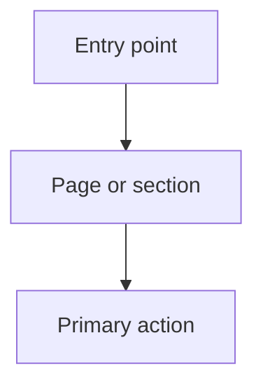

# Write a UI Spec

Create a UI specification document (`ui.md`) for a feature by exploring the existing frontend architecture, interviewing the user about page structure and access control, and producing a structured spec.

The spec should now cover both structure and low-fidelity layout:

- Information architecture and component structure
- Desktop and mobile wireframe-style sections
- Responsive layout notes
- Simple Mermaid diagrams for page/view flows when they help clarify navigation or multi-step interactions

## Process

### 1. Gather context

If a PRD or plan exists for the feature, read it first. Ask the user for a brain dump of what they want the UI to look like — pages, who sees what, key interactions.

### 2. Explore the frontend codebase

Before asking questions, explore to understand:
- Route structure and page organization
- Auth and role-based access patterns
- Navigation structure (sidebar, tabs, breadcrumbs)
- Shared layout and UI components (what's reusable)
- Feature folder conventions
- Similar features that can serve as prior art

This grounds the interview in what actually exists.

### 3. Interview the user

Walk through each page/view one at a time. For each, resolve:
- **Where does it live?** (new route, tab on existing page, section within existing view)
- **Who has access?** (roles, permissions, feature gates)
- **What does it contain?** (tables, forms, charts, cards, read-only info)
- **What actions are available?** (CRUD, bulk operations, exports, copy)
- **How do related entities appear?** (inline, expandable, side panel, dialog, separate page)
- **How does desktop differ from mobile?** (stacking, hidden columns, drawer vs sidebar, sticky actions, tab collapse, etc.)

Provide your recommended answer for each question. Resolve dependencies between decisions before moving on (e.g., settle where the page lives before discussing its contents).

### 4. Write the spec

Save to `.plans/<feature-name>/ui.md`. Use the template below.

<ui-spec-template>

# [Feature Name] — UI Specification

> Brief description of what this spec covers and its scope.

## Feature Gate

- Feature flag name (if applicable) and behavior when off

---

## Page N: [Page Title] (`/route`)

**Access:** [roles/permissions]

**Location:** Where in the app this lives (new sidebar entry, tab on existing page, nested route, etc.)

**Layout:** Layout pattern or component used.

**Responsive Notes:** Key desktop/mobile differences, including layout shifts, collapsed navigation, overflow behavior, and action placement.

### Flow Diagram

Use a simple Mermaid flow only when it adds clarity. Prefer one diagram per page or flow, not per tiny interaction.

### Desktop Wireframe

Describe the desktop layout in a low-fidelity wireframe style. Focus on regions and hierarchy, for example:

- Header with page title, breadcrumb, and primary CTA
- Left sidebar filters
- Main content area with summary cards above a table
- Right-side detail panel for row drill-in

### Mobile Wireframe

Describe the mobile layout in a low-fidelity wireframe style. Focus on stacking, condensed navigation, and action placement, for example:

- Top app bar with title and overflow menu
- Summary cards in a horizontal swipe or stacked list
- Filters behind a bottom sheet
- Table replaced by stacked entity cards

### Section/Tab N.N: [Name]

Description of what this section contains.

**Content:** What data is displayed and how (table with columns, card grid, form fields, chart type, summary stats, etc.). Be specific about fields/columns and their formatting.

**Filters/Controls:** Any filtering, sorting, search, date range pickers, or toggle controls.

**Actions:** Available user actions and how they're triggered (buttons, row actions, bulk selection, context menus).

**Create/Edit flows:** How creation and editing work (dialog, sheet/panel, inline, separate page). Specify fields.

**Reuse:** Specific existing components to reuse from the codebase.

---

## Component Summary

### New Components to Create

| Component | Location | Description |
|-----------|----------|-------------|

### Existing Components to Reuse

| Component | Source | Used For |
|-----------|--------|----------|

---

## Access Control Summary

| Page / Component | role1 | role2 | ... |
|-----------------|-------|-------|-----|

---

## Navigation Changes

New entries in sidebar, tab bars, or other navigation surfaces. Include placement order and gating conditions.

</ui-spec-template>

## Key Principles

- **Reuse first.** Check for existing shared components and layout primitives before proposing new ones.
- **Be specific about content and actions.** Vague specs lead to implementation guesswork. Name the fields, columns, and buttons.
- **Resolve sub-entity display patterns explicitly.** "Does this open a dialog, a side panel, or a new page?" is a design decision.
- **Feature-gate new navigation items** when the feature may be rolled out incrementally.
- **Separate management views from consumer views.** Admin CRUD and end-user read-only views are distinct, even if they share components.
- **Wireframe, don't art direct.** Include low-fidelity desktop/mobile layout guidance, but do not turn the spec into polished visual design directions.
- **Use diagrams selectively.** Add simple Mermaid flows when page transitions or multi-step interactions would otherwise be ambiguous.
